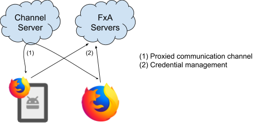
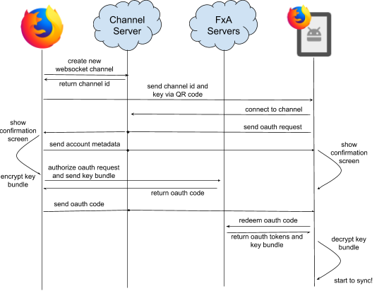

## Pairing Flow Architecture

The Desktop and Mobile devices will not communicate directly, because we cannot assume that they will be on the same network and because this is difficult to achieve from web content. Instead, they will exchange encrypted messages via websocket to a lightweight "channel server" service which can relay messages back and forth:




*****




### Detailed Flow

Is is advised to read the following section while looking at the detail digram while reading the information below.


[View / Edit in LucidChart](https://www.lucidchart.com/documents/edit/1bc1b604-0047-4542-8827-ed8518b0433e/0)


#### 1) Desktop opens an encrypted channel and advertises it via QR code

To make itself available for pairing, the Desktop device opens a connection to the Channel Server using the [fxa-pairing-channel library](https://github.com/mozilla/fxa-pairing-channel). 
Any application that learns the channel key will be able to request pairing from the Desktop device, or intercept messages exchanges during the pairing flow.
This library uses a subset of TLS-like communication between the two devices.
Once connected it will receive a server-allocated channel id, then the library will generate a 32-byte channel key to be used for client-side encryption of messages on the channel and derive a confirmation code that can be displayed to the user as visual confirmation the the devices are using the same key.
 * The channel key is what secures the pairing flow.
 * The channel id and channel key are encoded using base64url and then combined into a "pairing url". 
 * The generated URL looks like: https://accounts.firefox.com/pair#channel_id=[channel_id]&channel_key=[channel_key]
 * This URL is then encoded in a QR code and displayed on screen.
 
#### 2) Mobile scans the QR code and connects to the encrypted channel

To initiate pairing, the Mobile device scans the QR code displayed by Desktop and extracts the channel id and channel key.
It opens a websocket to the Channel Server using the same fxa-pairing-channel library specifying the channel id, channel key.
The Channel Server will now relay websocket messages from Mobile to Desktop and vice-versa.

#### 3) Devices exchange metadata and show confirmation screens

At this point the devices have established a baseline level of trust and can exchange metadata to allow the user to confirm the pairing on both sides. 

* We use explicit confirmation screens to reduce the risk of phishing or over-the-shoulder attacks.

The Mobile device sends what is essentially an OAuth request, delivered over the websocket channel rather than opened as a local webpage. 
It includes information such as:
```
client_id - its registered OAuth client id
state - OAuth state parameter
scope - requested OAuth scopes
code_challenge and code_challenge_method - OAuth PKCE parameters 
keys_jwk - FxA Scoped Keys key-fetching public key
```

The Desktop device must carefully check the provided OAuth request and error out if anything seems amiss.

The Desktop device sends an "account metadata" message that includes information about the account being connected to, such as:

```
the user's email address
the user's profile picture and display name
the device's display name.
Additional server derived information potentially including:
Counterpart's User Agent information
Counterpart's GeoIP derived location
```

This information will help the Mobile device show a meaningful confirmation screen. 
It's PII, but the channel has established a base level of trust between devices, so it should be safe to share this information directly.

* Upon receiving the metadata message from the other device, both Desktop and Mobile show an explicit confirmation screen. 
* There's no set confirmation order: the Supp and Auth will show the confirmations screens at the same time, and can be accepted in any order.

For additional security, the Channel Server annotates each message with information about the originating device, such as geoip lookup data. This may help the user detect if they're connecting to a different device than expected.

For additional security, each device can display the calculated confirmation code to the user. This may help the user detect if they're connecting to a different device than expected.

#### 4) Desktop device authorizes OAuth request

When the user accepts the confirmation screen on the Desktop device, it will use its local credentials to authorize the OAuth request from the Mobile device. This involves no user interaction, and will include the following steps:

* Check that redirect_uri is the expected value; error out if not.
* Check that scope contains exactly `"profile"` and `"https://identity.mozilla.com/apps/oldsync"`; error out if not.
* Check that client_id is the expected value; error out if not.
* Check that state exists and is well formed; error out if not.
* Check that code_challenge and code_challenge_method exist and are well formed; error out if not.
* Build the scoped-key bundle for `"https://identity.mozilla.com/apps/oldsync"`, encrypting it with the provided `keys_jwk` to produce `keys_jwe`.
* Generate a BrowserID assertion with the fxa-oauth-server as audience.
* POST all of this to fxa-oauth-server at `/v1/authorization` and receive back an OAuth code and state response parameters.

Desktop will then send the code and state parameters back to Mobile over the websocket channel, encrypted as before with the channel key.

#### 5) Mobile receives OAuth response and connects to Sync

When the user accepts the confirmation screen on the Mobile device, it will listen for the message produced by the Desktop device in step (4) above. After receiving the message, it can tear down its websocket channel.

* The Mobile can now complete its OAuth flow just as if it had received code and state via a standard web-content-based OAuth flow:
* Submit the code to fxa-oauth-server at /v1/token in exchange for an access token, refresh token, and bundle of encrypted key material.
* Decrypt the bundle of key material with its keys_jwk private key.
* Fetch user profile data, and check that it matches the data provided by Desktop in step (3).
* Use the access token and key material to access Firefox Sync.


## Exchanged messages specification

### Pairing Channel messages
These messages are forwarded between the Desktop native code and the web content page opened on the supplicant device.
Their payload is JSON object that contain a message identifier and a data object.
Every message envelope also contains information about the sender (IP address, geolocation..).


#### pair:supp:request

Direction: Supp -> Auth

Description: Sent right after connecting to the pairing channel by the supp. Contains OAuth PKCE parameters and a optionally a key encryption JWK.

```
{
  message: "pair:supp:request",
  data: {
    // See the OAuth server API doc for a description of the parameters.
    access_type,
    client_id,
    code_challenge,
    code_challenge_method,
    // FxA Scoped Keys key-fetching public key (base64url encoded).
    [keys_jwk,].
    scope,
    state,
  },
}
```


#### pair:auth:metadata

Direction: Auth -> Supp

Description: Sent by the Auth and contains the account and device information of the Auth.

```
{
  message: "pair:auth:metadata",
  data: {
    email,
    avatar,
    displayName,
    deviceName,
  },
}
```


#### pair:auth:authorize

Direction: Auth -> Supp

Description: Sent by the Auth once the pairing has been confirmed by the user on this side. Contains an OAuth code that can be traded for a token.

```
{
  message: "pair:auth:authorize",
  data: {
    // See the OAuth server API doc for a description of the parameters.
    code,
    state,
    redirect,
  },
}
```

#### pair:supp:authorize

Direction: Supp -> Auth

Description: Sent by the Supp once the pairing has been confirmed by the user on this side.

```
{
  message: "pair:supp:authorize",
}
```


### Desktop WebChannel messages

On Desktop, the Firefox Accounts Web Content page communicates with the native code (which owns the pairing channel connection) using WebChannel.
WebChannel messages can only be initiated from the content side, however the native side can send a response.

#### fxaccounts:pair_supplicant_metadata

Description: Allows the web content to request the supp’s device information.

Expected response:
```
{
  ua,
  city,
  region,
  country,
  ipAddress,
  confirmation_code,
}
```

#### fxaccounts:pair_authorize

Allows the web content to inform the native side the confirmation dialog has been accepted.

Expected response: N/A

#### fxaccounts:pair_heartbeat

Description: Sent by the web content every second or so. Allows to surface error but to also transition to a “completed” screen once the supp side has confirmed the pairing request.

Expected Response: 
```
{
  err, // String
}
<OR>
{
  suppAuthorized, // Boolean
}

```

#### fxaccounts:pair_complete

Description: Allows the web content to inform the native side it is aware the flow is finished, has shown a confirmation screen and the resources can be finalized on the native side.

Expected Response: N/A


## Other Details

### Views

* The Mobile (Supplicant) side, implements the following URL: https://accounts.firefox.com/pair/supp

This view accepts OAuth query parameters equivalent to those on the existing /oauth/ view, and will accept the channel id and channel key as parameters in the URL hash fragment. 
The view performs the entire Mobile side of the protocol, including:
 * connecting to the provided channel via websocket
 * passing the OAuth request to the Desktop over the websocket channel
 * displaying confirming screen using the account metadata information sent by Desktop
 * receiving OAuth code and state from Desktop over the websocket channel.
 * completing the OAuth flow by redirecting back to the relier


* For the Desktop side, we will implement a new view at the following URL: https://accounts.firefox.com/pair/auth

This view is responsible for performing the entire Desktop side of the protocol, including:
 * establishing the websocket channel and corresponding secret key
 * displaying the QR code as a URL to https://accounts.firefox.com/pair
 * receiving the OAuth request from the Mobile device
 * prompting the user for permission, and to re-enter their password
 * constructing the keys_jwe bundle and authorizing the OAuth request
 * return the OAuth code to the Mobile device over the websocket channel

### QR Code and URLs

The QR code is a URL: `https://accounts.firefox.com/pair/#channel_id=XY&channel_key=AB`

Combined with the OAuth flow it results in the following:

```
https://accounts.firefox.com/pair/supp
?client_id=<the client's oauth client id>
&state=<generated state token>
&scope=<scopes to request>
&code_challenge=<generated PKCE challenge>
&code_challenge_method=<generated PKCE challenge method>
&keys_jwk=<generated public key>
&redirect_uri=<the client's registered redirect_uri>
#channel_id=XYZ&channel_key=ABC
```

Open the constructed URL, just as it would if it were initiating a standard username-and-password OAuth flow.
Wait for a redirect from the opened OAuth flow to return `code` and `state` parameters.
* After the OAuth flow redirects with the `code`, it can be exchanged for the `keys_jwe` bundle.
* Decrypt the key bundle using corresponding private key for `keys_jwk`.
* The Desktop pairing flow implements a custom `redirect_uri` - `urn:ietf:wg:oauth:2.0:oob:pair-auth-webchannel`. This indicates that this is a pairing flow.
